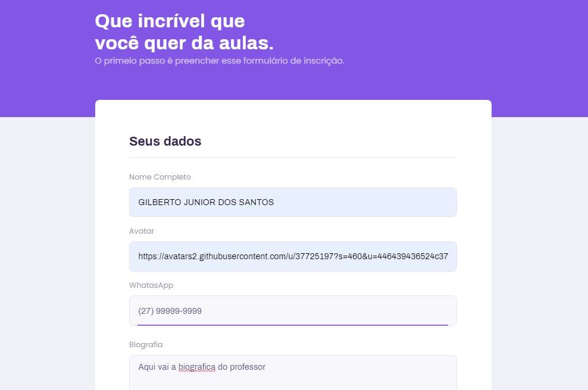
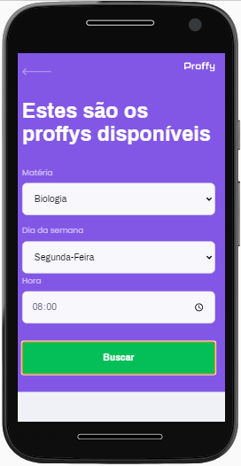

# Front-End Proffy

Front-End desenvolvido com `React Js` com `template TYPESCRIPT`

## Scripts disponíveis `Git Clone`

No diretório do projeto, você pode executar:

Após fazer o clone ou download do projeto, execute `npm install` para que possa instalar todas as dependências que foram usadas.

# *API Desenvolvida com:* 
            * ReactJs

# *Dependências:* 
            * axios
            * react
            * react-dom
            * react-router-dom
            * typescript

### `yarn start` ou `npm start`

Ao executar o aplicativo, o projeto vai abrir automaticamente no endereço [http://localhost:3000](http://localhost:3000).

Qualquer edição que você fizer no arquivo, a página sera recarregada. 

Você também verá os erros no console.

# ScreenShot Web

# ScreenShot Web Mobile

